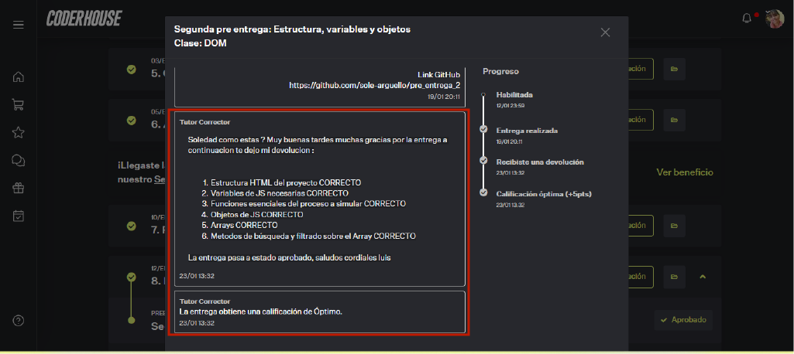

# pre_entrega_2: Simulador Interactivo (segunda parte)
     Deberás entregar la estructura del proyecto, las variables de JS necesarias y los objetos de JS, 
     correspondientes a la segunda entrega de tu proyecto final.

### DEMO: https://sole-arguello.github.io/pre_entrega_2/ 

## Temas visto:
5. Objetos
6. Arrays
7. Funciones de orden superior

### Objetivos generales:

     Codificar la funcionalidad inicial del simulador. 
     Identificar el flujo de trabajo del script en términos de captura de entradas ingresadas por el usuario, 
     procesamiento esencial del simulador y notificación de resultados en forma de salida.
     
### Formato:

     Página HTML y  código fuente en JavaScript. Debe identificar el apellido del alumno/a en el nombre de 
     archivo comprimido por “PreEntrega2+Apellido
     
### Objetivos específicos:

     * Capturar entradas mediante prompt().
     * Declarar variables y objetos necesarios para simular el proceso seleccionado.
     * Crear funciones y/o métodos para realizar operaciones (suma, resta, concatenación, división, porcentaje, etc).
     * Efectuar una salida, que es el resultado de los datos procesados, la cual puede hacerse por alert() o console.log().

### Sugerencias:

     Si bien, por el momento solo podemos hacer entradas con prompt() y salidas con alert() o console.log(), 
     es suficiente para empezar a pensar el proceso a simular en términos de entradas, variables, estructuras, 
     funciones, métodos y salidas. Verificar Rúbrica

### Se debe entregar:

     * Estructura HTML del proyecto. 
     * Variables de JS necesarias. 
     * Funciones esenciales del proceso a simular.
     * Objetos de JS.
     * Arrays.
     * Métodos de búsqueda y filtrado sobre el Array.

### Para tener en cuenta:

     La estructura hace referencia a el html y css, correspondientes al armado de la página general, pero que el JS que se evalúa,
     aún no está interactuando con ella.

### Nota obtenida:

### Devolucion:

